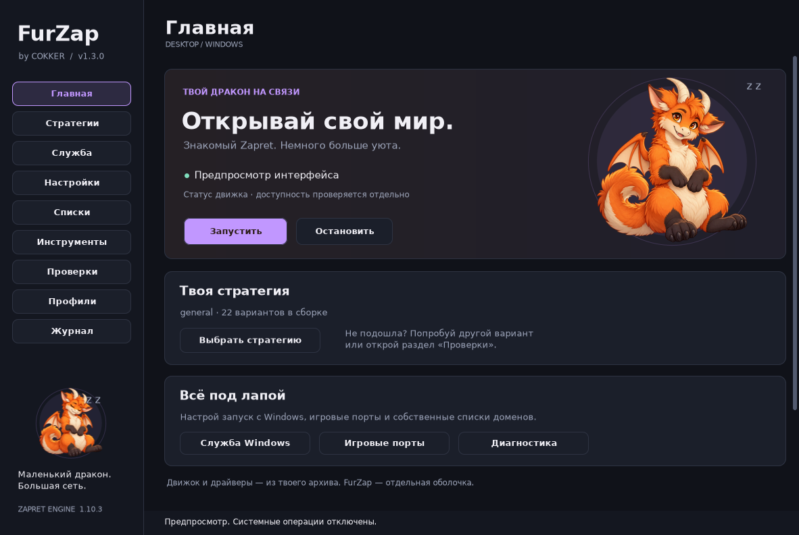

# FurZap

Windows-приложение от **COKKER** для управления Zapret: тёмный интерфейс, оранжевый дракон, профили и встроенные проверки доступности.



## Скачать и запустить

Версия оболочки: **1.2.2**. Комплект движка: **zapret-discord-youtube 1.10.3**.

1. Скачай `FurZap-Windows-x64.zip` из раздела **Releases** и распакуй весь архив.
2. Запусти `FurZap.exe` и подтверди запрос прав администратора.
3. В разделе **Стратегии** выбери вариант и нажми **Выбрать и запустить**.
4. Проверь нужные сайты и приложения в своей сети.

Требуются Windows 10/11 x64 и .NET Framework 4.7.2 или новее.

**Обновление:** закрой FurZap и замени `FurZap.exe` из нового архива. Сохрани свои папки `engine` и `data`. Изображения дракона встроены в EXE.

## Возможности

- Выбор из 22 стратегий, поиск и просмотр параметров.
- Запуск своего процесса, управление службой Windows и автозапуском.
- Игровые TCP/UDP-порты, IPSet, списки доменов и исключения.
- Выбор пакетов Discord и Game Filter.
- Профили, история изменений и возврат к отмеченной рабочей конфигурации.
- Подбор стратегий с прогрессом, отменой и восстановлением прежнего состояния.
- HTTPS-проверки Discord, YouTube и VRChat.
- Диагностика, журнал, обновление IPSet, управление собственным блоком hosts.
- Трей, три цветовые темы, масштаб до 150% и компактный режим.
- Реакции дракона, плавные переходы поз, отключаемые анимации и звуки.

## Исправления 1.2.2

- Убрано изменение прозрачности всего окна при переключении разделов.
- Анимации кнопок и дракона сохранены.

## Исправления 1.2.1

- Открытие списка и изменение оформления больше не считаются редактированием текста.
- Удалены линии под переключателями.
- Исправлено освобождение `ToolStripDropDown` во время закрытия меню.
- Анимации используют общий цикл с целью 60 Гц и переходы поз длительностью 240 мс.
- При уменьшении окна подписи не создают лишнюю горизонтальную прокрутку.

## Сборка из исходников

Исходники находятся в `source/`. На Windows запусти:

```bat
source\build-windows.cmd
```

Скрипт использует компилятор .NET Framework из Windows и создаёт `FurZap.exe` рядом с папкой `engine`. Нужны также папка `assets`, `furzap.ico` и `source/app.manifest` из репозитория.

Проверки логики:

```bat
FurZap.exe --self-test
```

Просмотр интерфейса без запуска движка:

```bat
FurZap.exe --preview
```

## Проверено и ограничения

Пройдены 102 проверки логики и 47 проверок интерфейса под Mono/Xvfb. Подробности — в `source/verification.txt`.

В последнем Linux-предпросмотре получено около 60 кадров/с. Целевые 60 FPS не являются гарантией фактической частоты на конкретном ПК. Нативное исполнение драйвера, UAC и служб Windows в этой среде не проверялось.

Успешный HTTPS-запрос не подтверждает работу голосовой связи, видео, авторизации и всех адресов сервиса. Голос проверяется отдельно в реальном разговоре. Подходящая стратегия зависит от сети.

## Движок и сторонние компоненты

FurZap — отдельная оболочка. Комплект `engine` взят из предоставленного архива проекта [Flowseal/zapret-discord-youtube](https://github.com/Flowseal/zapret-discord-youtube). Движок и сторонние библиотеки не являются авторской разработкой FurZap; их условия использования определяются соответствующими правообладателями.

Полное руководство: [README.txt](README.txt).
